# Video-Maker
Projetos para fazer vídeos automatizados

## Requisitos
- Git (https://git-scm.com/)
- Node (https://nodejs.org)

## Preparando o Repositório
Utilizando o terminal, execute os comandos:
```
git clone https://github.com/felipeMarajo/Video-Maker-1.0.git
cd Video-Maker-1.0
npm install
```

## Adicionando Api keys ao projeto

### Algorithmia ###
Cadastre-se no site [Algorithmia](https://www.algorithmia.com/), depois acesse **API Keys** na Dashboard e **copie**.

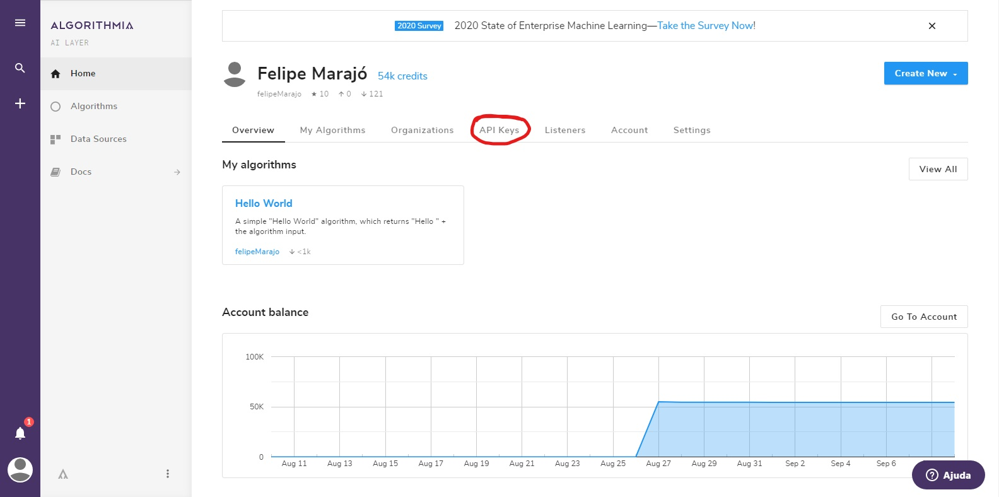
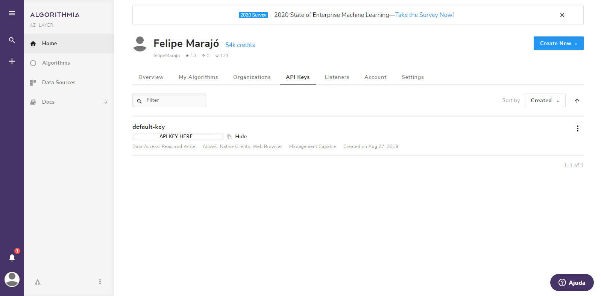


Na pasta **credentials** crie um arquivo chamado `algorithmia.json`. Atenção, o arquivo deve ter **exatamente** esse nome. Dentro do arquivo, cole a apiKey encontrada no site Algorithmia no formato abaixo:

``` js
"apiKey": "API-KEY-HERE"
```

### IBM Watson ###
Você precisará também das credenciais do [IBM Watson](https://cloud.ibm.com/login). Cadastre-se no site e quando estiver logado clique em **catálogo** depois em **IA** e busque por *Natural Language Understanding*.

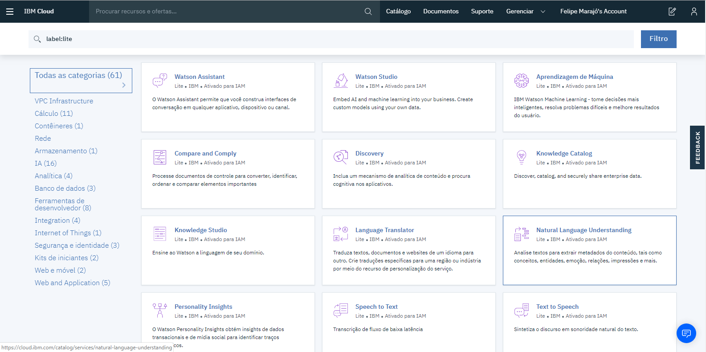

Clicando em *Natural Language Understanding* você será direcionado para uma outra página. Clique no botão **Criar** no fim da página. Após a criação você estará na página de gerenciamento. No menu lateral esquerdo clique em **Credenciais de Serviços** e depois em **Visualizar credenciais** em Auto-generated service credentials.

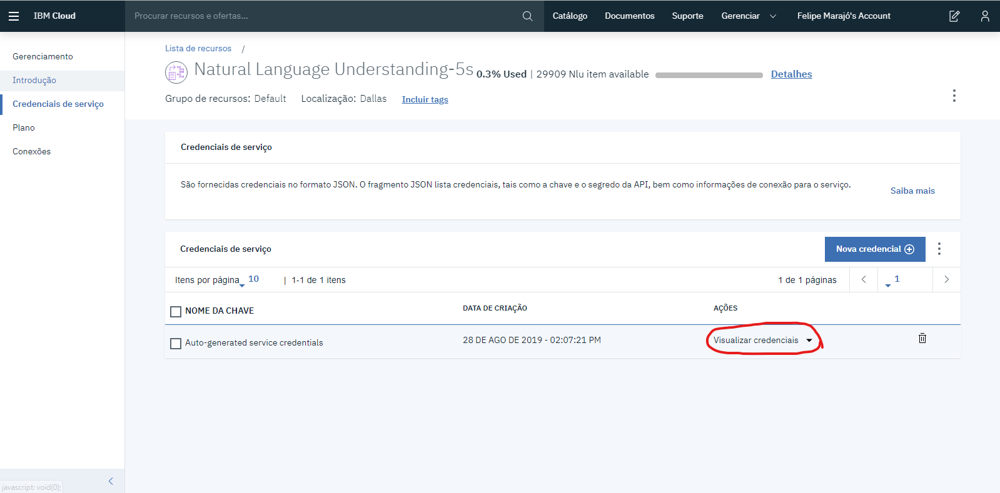

Na pasta **credentials** crie um arquivo chamado `watson-nlu.json`. Atenção, o arquivo deve ter exatamente esse nome. Dentro do arquivo, cole a api encontrada no site do watson no formato abaixo: 

``` js
{
  "apikey" : "...",
  "iam_apikey_description" : "...",
  "iam_apikey_name": "...",
  "iam_role_crn": "...",
  "iam_serviceid_crn": "...",
  "url": "..."
}
```

### Google Cloud Plataform ###
Para ter acesso aos serviços do [Google Cloud Plataform](https://cloud.google.com) é necessário vincular uma conta google e depois adicionar um cartão de credito. Isso é necessário pois algumas api's são pagas, entretanto, o projeto utiliza apenas serviços **gratuitos**.

Depois de vincular a conta ao Google Cloud Plataform, iremos criar um projeto. Na parte superior da página clicaremos em **selecione um projeto** e em seguida em **Novo Projeto**.

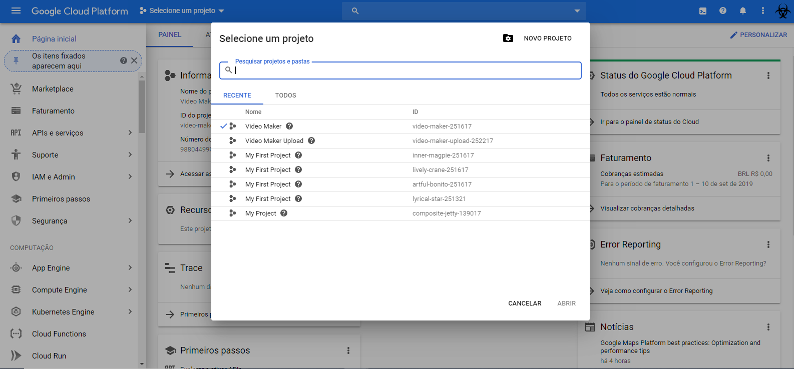

Nomeie o projeto e clique em **criar**.

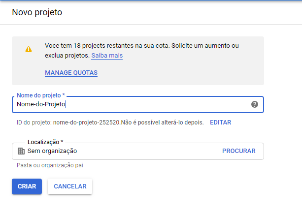

### Custom Search API ###
Depois que o projeto estiver criado, você irá no menu da esquerda clicará em **APIs e serviços** > **Biblioteca**.

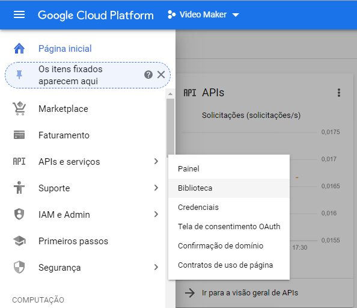

No campo de pesquisa procure por: **Custom Search API**. Clique na API e depois clique em **Ativar**. Depois de ativa, você clicará em **Criar Credenciais** na mensagem que aparece no topo da página.

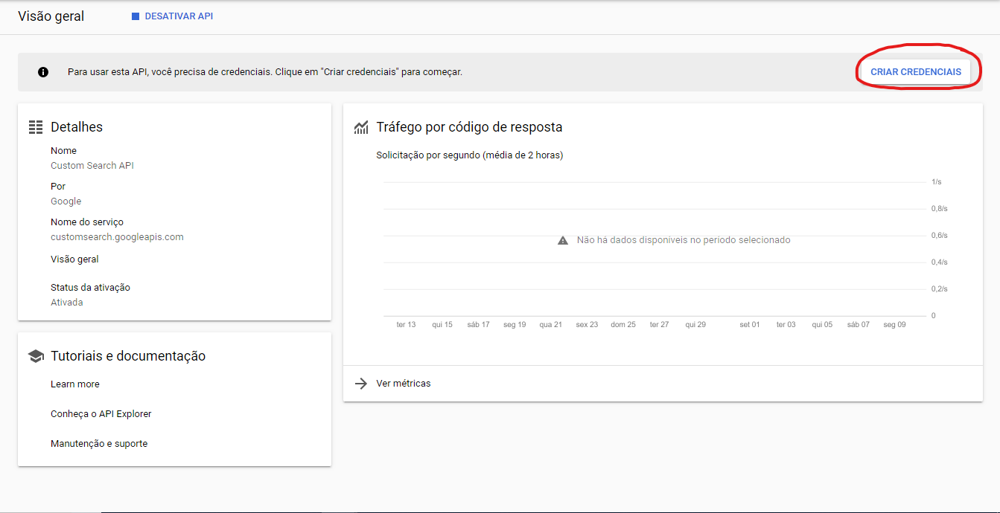

No menu lateral esquerdo abra em uma nova guia a opção **Credenciais**. Na nova guia clique em **Criar credenciais** e selecione **Chave de API**.

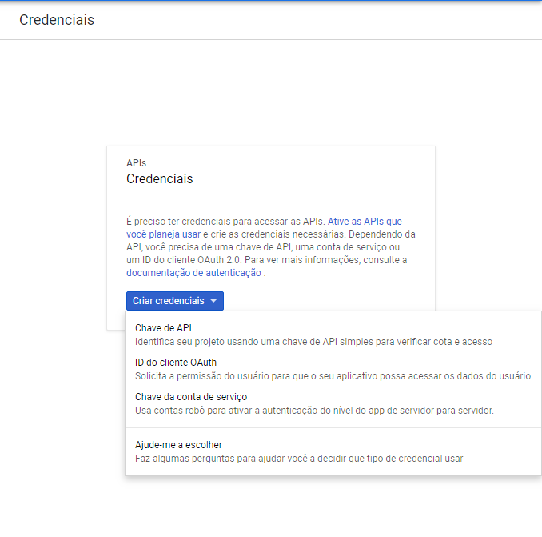

Com a ApiKey criada, copie a chave. Na pasta **credentials** do projeto, crie um novo arquivo chamado **google-search.json**, com o seguinte conteúdo:

``` js
"apiKey": "API-KEY-HERE"
```

### Custom Search Enginer ###
Para configurar o motor de busca do google, você terá que acessar [Custom Search Engine](https://cse.google.com/cse/create/new). Informe o site a pesquisar colocando google.com, agora clique em criar.

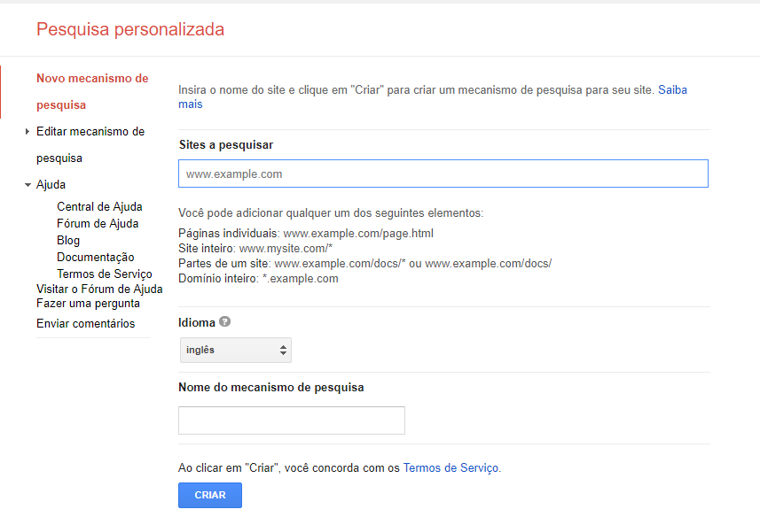

Depois de criar a pesquisa personalizada clique em **Editar mecanismo de pesquisa** e em seguida ative: **pesquisa de imagens**, **pesquisar em toda web**. No campo **Restringir páginas que usam tipos Schema.org** digite ***Thing***.

No arquivo **google-search.json**, deve-se criar uma nova propriedade, chamada `searchEngineId`, que está na página de  pesquisa personalisada.

```
{
  "apiKey": "API-KEY-HERE"
  "searchEngineId": "ID-mecanismo-de-pesquisa "
}
```

### Youtube ###
Para configurar a API do Youtube volte no [Google Cloud Plataform](https://cloud.google.com), e ative o serviço do Youtube clicando em **APIS e Serviços** depois em **Biblioteca**. Agora vá novamente no menu esquerdo em **APIS e Serviços -> Tela de consentimento OAuth** e preencha apenas o campo *nome do aplicativo* e depois clique em salvar.

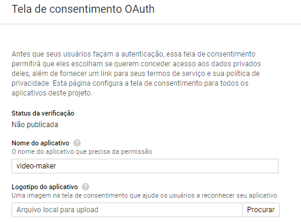

No menu esquerdo clique em Credenciais e depois em **Criar credenciais** e selecione a opção **ID do cliente OAuth**.

Na próxima página escolha **Aplicativo da Web** para o tipo de aplicativo, nomeie o aplicativo para finalizar em **Origens JavaScript autorizadas** insira *http://localhost:5000*, e em **URIs de redirecionamento autorizados** digite *http://localhost:5000/oauth2callback*, depois clique em criar.

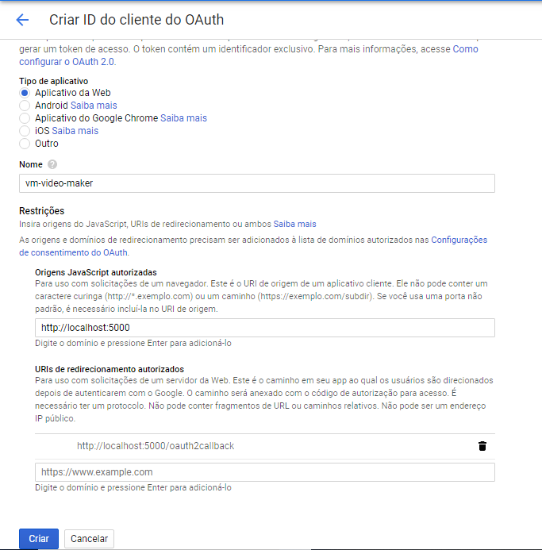

Quando a credencial for criada clique em *OK* na janela que irá aparecer. Agora baixe as credenciais e renomeie o arquivo para **youtube.json** e salve na pasta credentials.

## Executando! ##
Dentro da pasta video-maker abra o cmd e execute o comando:
```
node index.js
```  